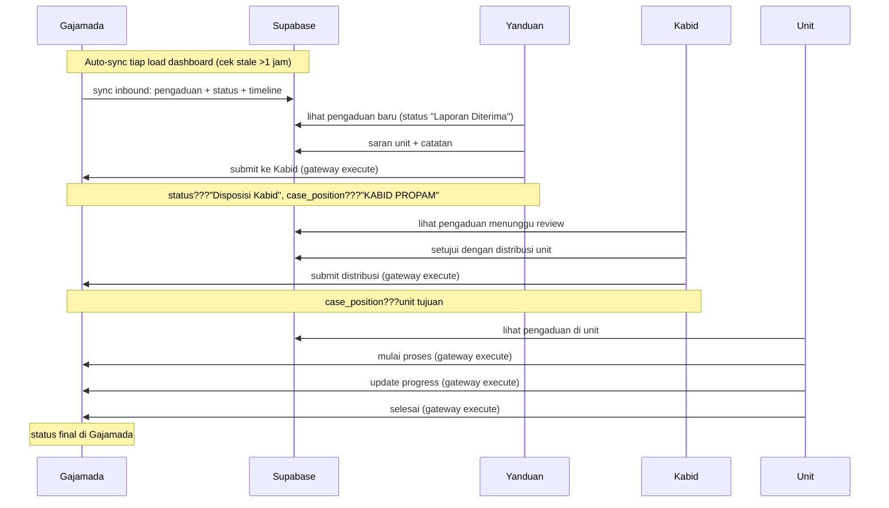
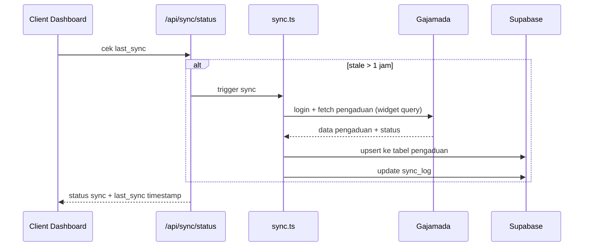
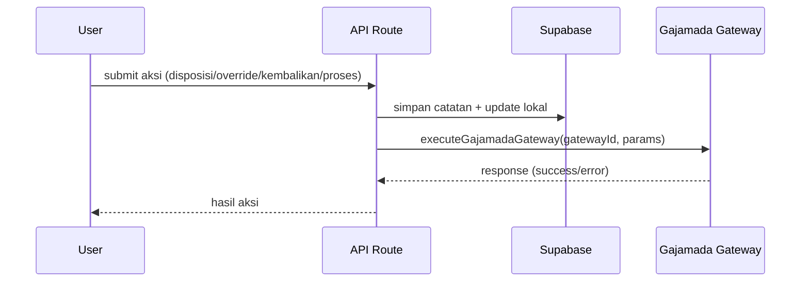

# Key flows

## End-to-end: Yanduan ??? Kabid ??? Unit ??? Selesai

```mermaid
sequenceDiagram
  participant G as Gajamada
  participant S as Supabase
  participant Y as Yanduan
  participant K as Kabid
  participant U as Unit

  Note over G,S: Auto-sync tiap load dashboard (cek stale >1 jam)
  G->>S: sync inbound: pengaduan + status + timeline

  Y->>S: lihat pengaduan baru (status "Laporan Diterima")
  Y->>S: saran unit + catatan
  Y->>G: submit ke Kabid (gateway execute)
  Note over Y,G: status???"Disposisi Kabid", case_position???"KABID PROPAM"

  K->>S: lihat pengaduan menunggu review
  K->>S: setujui dengan distribusi unit
  K->>G: submit distribusi (gateway execute)
  Note over K,G: case_position???unit tujuan

  U->>S: lihat pengaduan di unit
  U->>G: mulai proses (gateway execute)
  U->>G: update progress (gateway execute)
  U->>G: selesai (gateway execute)
  Note over G: status final di Gajamada
```

## Auto-sync flow

```mermaid
sequenceDiagram
  participant C as Client Dashboard
  participant API as /api/sync/status
  participant SYNC as sync.ts
  participant G as Gajamada
  participant SB as Supabase

  C->>API: cek last_sync
  alt stale > 1 jam
    API->>SYNC: trigger sync
    SYNC->>G: login + fetch pengaduan (widget query)
    G-->>SYNC: data pengaduan + status
    SYNC->>SB: upsert ke tabel pengaduan
    SYNC->>SB: update sync_log
  end
  API-->>C: status sync + last_sync timestamp
```

## Card Aksi flow

```mermaid
sequenceDiagram
  participant U as User
  participant API as API Route
  participant DB as Supabase
  participant GW as Gajamada Gateway

  U->>API: submit aksi (disposisi/override/kembalikan/proses)
  API->>DB: simpan catatan + update lokal
  API->>GW: executeGajamadaGateway(gatewayId, params)
  GW-->>API: response (success/error)
  API-->>U: hasil aksi
```
