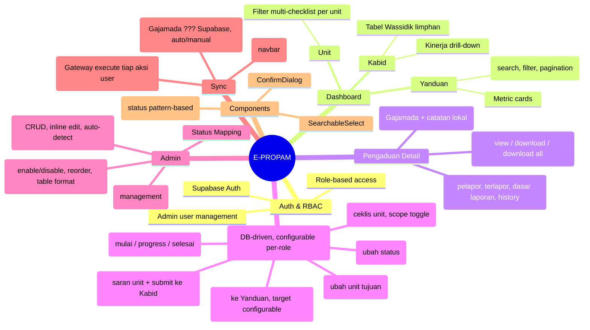

# Feature mindmap

## Feature mindmap

```mermaid
mindmap
  root((E-PROPAM))
    Auth & RBAC
      Supabase Auth
      Role-based access
      Admin user management
    Dashboard
      Yanduan
        Metric cards
        Tabel pengaduan (search, filter, pagination)
      Kabid
        Kinerja drill-down
        Tabel Wassidik limphan
      Unit
        Filter multi-checklist per unit
    Pengaduan Detail
      Tabs (pelapor, terlapor, dasar laporan, history)
      Timeline unified (Gajamada + catatan lokal)
      Bukti pendukung (view / download / download all)
    Card Aksi (DB-driven, configurable per-role)
      Disposisi (saran unit + submit ke Kabid)
      Override (ubah unit tujuan)
      Override Status (ubah status)
      Kembalikan (ke Yanduan, target configurable)
      Unit Proses (mulai / progress / selesai)
      Distribusi (ceklis unit, scope toggle)
    Admin
      Unit Mapping (CRUD, inline edit, auto-detect)
      Status Mapping
      Card Layout (enable/disable, reorder, table format)
      Users (management)
    Sync
      Inbound (Gajamada ??? Supabase, auto/manual)
      Outbound (Gateway execute tiap aksi user)
      Sync indicator (navbar)
    Components
      SearchableSelect
      ConfirmDialog
      Badge (status pattern-based)
```
