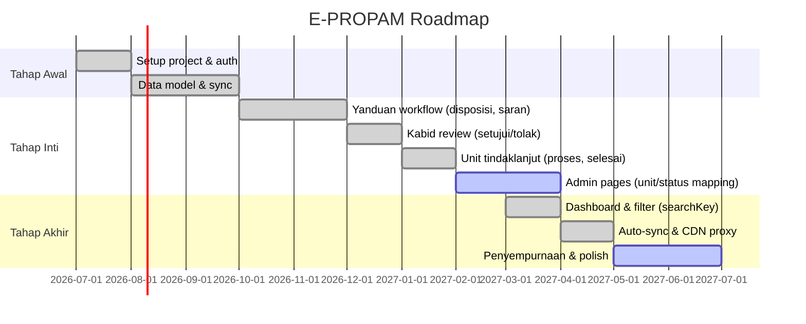

# Roadmap

## Milestones

## Status Saat Ini (14 Juli 2026)

| Area | Status |
|------|--------|
| Auth & Role | done |
| Sync inbound (Gajamada → Supabase) | done |
| Yanduan dashboard + disposisi | done |
| Kabid review + approve/reject | done |
| Unit tindaklanjut (mulai/progress/selesai) | done |
| Admin unit-mapping (CRUD, inline edit) | done |
| Admin status-mapping | active |
| Auto-sync (stale >1 jam) | done |
| CDN proxy for bukti | done |
| Theme (dark cards) | done |
| AGENTS.md + AI rules | done |
