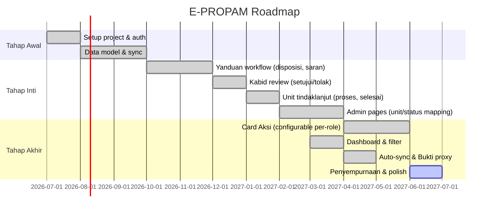

# Roadmap

## Milestones

## Status Saat Ini (15 Juli 2026)

| Area | Status |
|------|--------|
| Auth & Role (RBAC) | done |
| Sync inbound (Gajamada → Supabase) | done |
| Yanduan dashboard + disposisi | done |
| Kabid dashboard + pengaduan detail | done |
| Unit dashboard + filter multi-checklist | done |
| Card Aksi (DB-driven, configurable per-role, 9 cards) | done |
| Card Distribusi (ceklis disposisi, scope toggle) | done |
| Card Override + Status (searchable combobox) | done |
| Card Unit Proses (mulai/progress/selesai + Gajamada sync) | done |
| Card Kembalikan (target configurable) | done |
| Admin card-layout (table format, enable/disable, reorder) | done |
| Admin unit-mapping (CRUD, inline edit) | done |
| Timeline unified (Gajamada + catatan lokal) | done |
| Bukti Pendukung (view/download/download all) | done |
| Searchable combobox (SearchableSelect component) | done |
| Scope toggle (KASUBBID/Semua unit) | done |
| Role-based data access (scope filtering) | done |
| Reporter count (NIK-based, Polda Jabar + Nasional) | done |
| Auto-sync (stale >1 jam) | done |
| Theme (compact padding) | done |
| AGENTS.md + AI rules | done |
