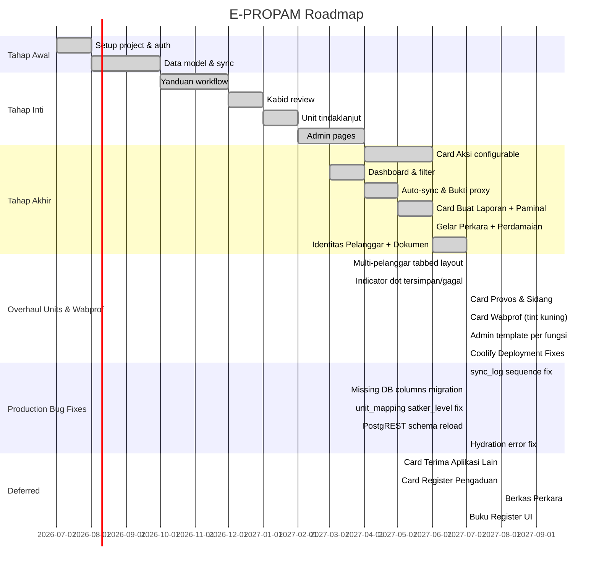

# Roadmap

## Milestones

## Keputusan Produksi (2026-07-24)

- `sync_log` menggunakan `serial` PK — sequence dapat tertinggal jika ada insert manual. Fix: `setval` ke MAX(id).
- Kolom `disposisi_submitted_at` (dan kolom workflow lain) belum ada di DB saat deploy → migration `015_add_missing_workflow_columns.sql`.
- `unit_mapping.satker_level` check constraint lama tidak mencakup `kabid/tabes/brimob/ditpolair` → constraint diperbarui.
- 11 row `unit_mapping` dengan `satker_level = NULL` menyebabkan `/api/units` 500 → di-fix via SQL.
- PostgREST schema cache perlu restart container `supabase-rest` setelah ALTER TABLE.
- React Hydration Error #418 terjadi di elemen yang render tanggal (timezone server vs browser) → fix dengan `suppressHydrationWarning`.
