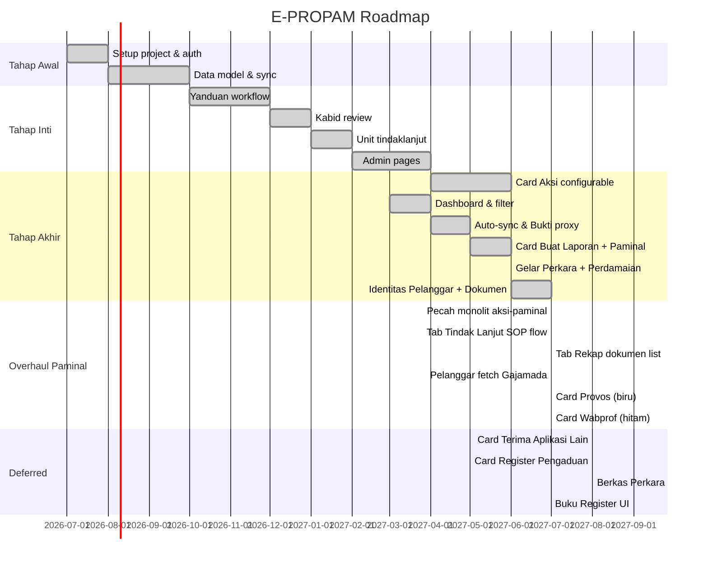

# Roadmap

## Milestones

```mermaid
gantt
    title E-PROPAM Roadmap
    dateFormat  YYYY-MM
    section Tahap Awal
    Setup project & auth         :done, 2026-07, 2026-08
    Data model & sync            :done, 2026-08, 2026-10
    section Tahap Inti
    Yanduan workflow             :done, 2026-10, 2026-12
    Kabid review                 :done, 2026-12, 2027-01
    Unit tindaklanjut            :done, 2027-01, 2027-02
    Admin pages                  :done, 2027-02, 2027-04
    section Tahap Akhir
    Card Aksi configurable       :done, 2027-04, 2027-06
    Dashboard & filter           :done, 2027-03, 2027-04
    Auto-sync & Bukti proxy      :done, 2027-04, 2027-05
    Card Buat Laporan + Paminal  :done, 2027-05, 2027-06
    Gelar Perkara + Perdamaian   :done, 2027-06, 2027-06
    Identitas Pelanggar + Dokumen:done, 2027-06, 2027-07
    section Overhaul Paminal
    Pecah monolit aksi-paminal   :done, 2027-07, 2027-07
    Tab Tindak Lanjut SOP flow   :done, 2027-07, 2027-07
    Tab Rekap dokumen list       :done, 2027-07, 2027-07
    Pelanggar fetch Gajamada     :done, 2027-07, 2027-07
    Card Provos (biru)           :done, 2027-07, 2027-07
    Card Wabprof (hitam)         :active, 2027-07, 2027-07
    section Deferred
    Card Terima Aplikasi Lain    :pending, 2027-08, 2027-08
    Card Register Pengaduan      :pending, 2027-08, 2027-08
    Berkas Perkara               :pending, 2027-08, 2027-08
    Buku Register UI             :pending, 2027-09, 2027-09
```
