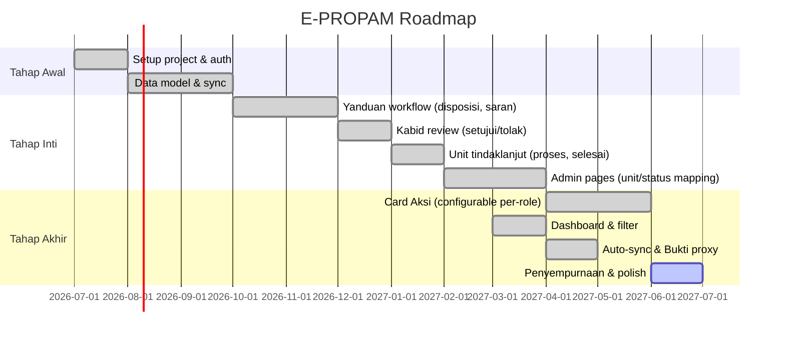

# Roadmap

## Milestones

## Status Saat Ini (15 Juli 2026)

| Area | Status |
|------|--------|
| Auth & Role (RBAC) | done |
| Sync inbound (Gajamada → Supabase) | done |
| Yanduan dashboard + disposisi | done |
| Kabid dashboard + pengaduan detail | done |
| Unit dashboard + filter multi-checklist | done |
| Card Aksi (DB-driven, configurable per-role, 9 cards) | done |
| Card Distribusi (ceklis disposisi, scope toggle) | done |
| Card Override + Status (searchable combobox) | done |
| Card Unit Proses (mulai/progress/selesai + Gajamada sync) | done |
| Card Kembalikan (target configurable) | done |
| Admin card-layout (table format, enable/disable, reorder) | done |
| Admin unit-mapping (CRUD, inline edit) | done |
| Timeline unified (Gajamada + catatan lokal) | done |
| Bukti Pendukung (view/download/download all) | done |
| Searchable combobox (SearchableSelect component) | done |
| Scope toggle (KASUBBID/Semua unit) | done |
| Role-based data access (scope filtering) | done |
| Reporter count (NIK-based, Polda Jabar + Nasional) | done |
| Auto-sync (stale >1 jam) | done |
| Theme (compact padding) | done |
| AGENTS.md + AI rules | done |
| Card Buat Laporan (Lapinfo/LP-A) — internal report creation | done |
| Card Proses 4-Stage Paminal (SOP-based: Perencanaan→Pengumpulan→Pengolahan→Pelaporan) | done |
| Gelar Perkara (tanggal + notulen) | done |
| Perdamaian (Syarat Materiil/Formil/Pembatas) | done |
| Identitas Pelanggar (Terbukti) | done |
| File upload dokumen (Supabase Storage) | done |
| DocTemplateInput — reusable template nomor + upload | done |
| Buku Register — sequential numbering per unit/type/year | done |
| Dokumen Perkara — document tracking per pengaduan | done |
| Dev Unit Selector (navbar) | done |
| Cetak Lembar Informasi (Dasar, Pelapor, Terlapor, Timeline + logo + page break) | done |
| Status display mapping (Restorative Justice → Perdamaian) | done |
| Unit filter combobox (hide for non-leadership, show count) | done |
| Dokumen Upload deduplication (merge local + rekap by URL) | done |
| Reset button preserves uploaded files | done |
| Superpowers + brain skills installed | done |

## Deferred

| Area | Status |
|------|--------|
| Card Terima Aplikasi Lain (Kabid) | pending |
| Card Register Pengaduan (Yanduan) | pending |
| Card Proses Provos (4-stage sidang disiplin) | pending |
| Card Proses Wabprof (4-stage sidang KKEP) | pending |
| Berkas Perkara (grouping multi-pengaduan) | pending |
| Buku Register UI (admin read-only view) | pending |
