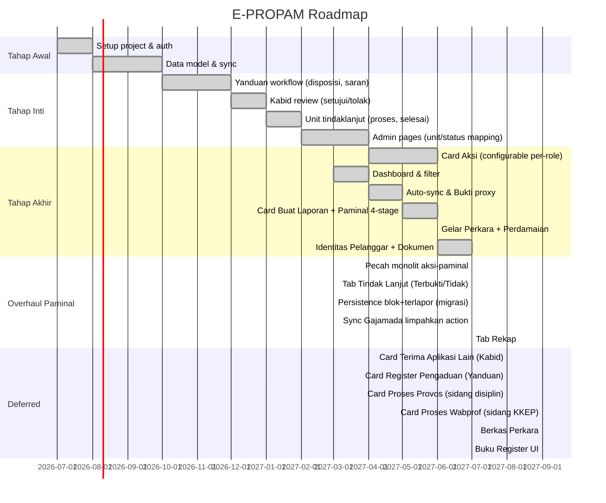

# Roadmap

---
slug: roadmap
title: Roadmap
role: milestones
updated: "2026-07-18T12:00:00"
---

# Roadmap

## Milestones

```mermaid
gantt
    title E-PROPAM Roadmap
    dateFormat  YYYY-MM
    section Tahap Awal
    Setup project & auth         :done, 2026-07, 2026-08
    Data model & sync            :done, 2026-08, 2026-10
    section Tahap Inti
    Yanduan workflow (disposisi, saran) :done, 2026-10, 2026-12
    Kabid review (setujui/tolak)        :done, 2026-12, 2027-01
    Unit tindaklanjut (proses, selesai) :done, 2027-01, 2027-02
    Admin pages (unit/status mapping)   :done, 2027-02, 2027-04
    section Tahap Akhir
    Card Aksi (configurable per-role)   :done, 2027-04, 2027-06
    Dashboard & filter                  :done, 2027-03, 2027-04
    Auto-sync & Bukti proxy             :done, 2027-04, 2027-05
    Card Buat Laporan + Paminal 4-stage :done, 2027-05, 2027-06
    Gelar Perkara + Perdamaian          :done, 2027-06, 2027-06
    Identitas Pelanggar + Dokumen       :done, 2027-06, 2027-07
    section Overhaul Paminal
    Pecah monolit aksi-paminal          :done, 2027-07, 2027-07
    Tab Tindak Lanjut (Terbukti/Tidak)  :done, 2027-07, 2027-07
    Persistence blok+terlapor (migrasi) :done, 2027-07, 2027-07
    Sync Gajamada limpahkan action      :done, 2027-07, 2027-07
    Tab Rekap                           :done, 2027-07, 2027-07
    section Deferred
    Card Terima Aplikasi Lain (Kabid)   :pending, 2027-08, 2027-08
    Card Register Pengaduan (Yanduan)   :pending, 2027-08, 2027-08
    Card Proses Provos (sidang disiplin):pending, 2027-08, 2027-08
    Card Proses Wabprof (sidang KKEP)   :pending, 2027-09, 2027-09
    Berkas Perkara                      :pending, 2027-09, 2027-09
    Buku Register UI                    :pending, 2027-09, 2027-09
```
